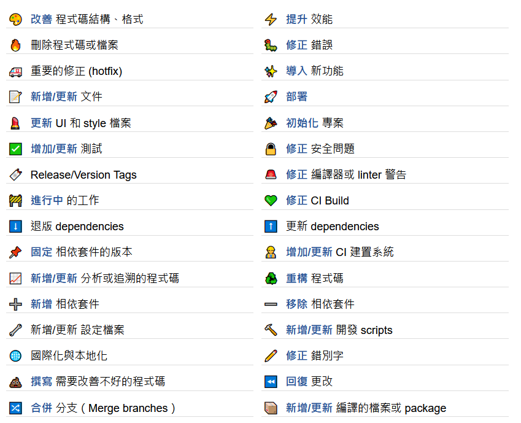

# 生產力 UP

	

  
   
  提升效率、生產力的「檔案」們

## Overview

- [Gitmoji](Gitmoji.html) - `Gitmoji.html`
  瀏覽並複製 Gitmoji
- ...

## Gitmoji

修改自其他人的 Guide

- 中文化，使用台灣用語
- 列表緊密，滑動自頂至底省時
- 點「整列」可直接複製，方便使用

## TODO

- ...

## 相依函式庫

使用到的 js

- 複製文字 https://clipboardjs.com/
- 